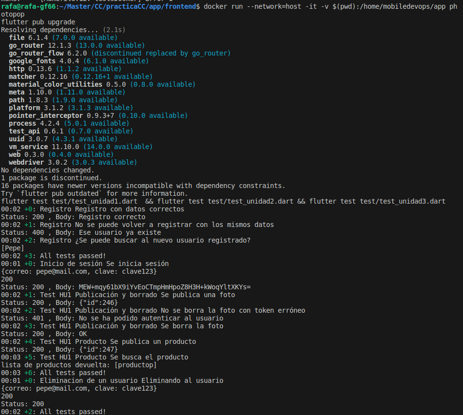

# Hito 3: Creación de un contenedor para pruebas

Se ha escogido como contenedor base el del siguiente dockerhub:

[Contenedor base](https://hub.docker.com/r/mobiledevops/flutter-sdk-image)


Este contenedor contiene la aplicación de flutter con el objetivo de poder hacer builds, pero yo 

voy a usarla con el fin de hacer tests.


Se intentó crear un contenedor desde 0 pero hay muchos problemas para la instalación de Flutter.


## Creación del Dockerfile

En este dockerfile se hacen las modificaciones y actualizaciones pertinentes para que el contenedor pueda
llevar a cabo las pruebas. La aplicación flutter estará en un volume al cuál se accederá desde el contenedor para hacer el test.

```Dockerfile

FROM mobiledevops/flutter-sdk-image
USER root


RUN apt-get update & apt-get upgrade
RUN git config --global --add safe.directory /home/mobiledevops/.flutter-sdk

RUN flutter upgrade

CMD make


```

## Ejecución de los tests
Una vez que está preparado nuestro contenedor lo ejecutamos para saber si realiza bien el test

ADVERTENCIA:

Este contenedor ejecuta los tests de la aplicación de flutter, sería necesario que en otra máquina se lanzase el servidor de Node.js para que los tests puedan ejecutarse ya que es necesaria la conexión a un servidor.

Para ejecutar el docker uso el comando :

```bash
docker run --network=host -it -v $(pwd):/home/mobiledevops/app photopop

```




## Subida a DockerHub

Este contenedor está subido a dockerhub en el siguiente enlace:

[Enlace Dockerhub](https://hub.docker.com/r/rafaguzmanval/photopop)


